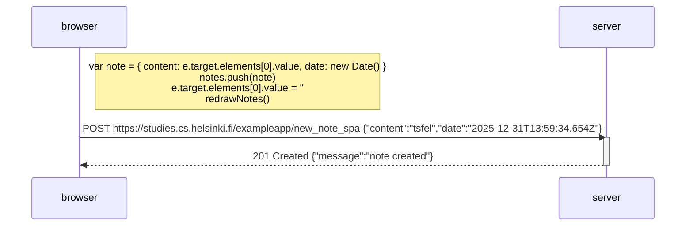

```mermaid
sequenceDiagram
    participant browser
    participant server

    Note right of browser: var note = { content: e.target.elements[0].value, date: new Date() } <br/>notes.push(note) <br/> e.target.elements[0].value = '' <br/> redrawNotes()

    browser->>server: POST https://studies.cs.helsinki.fi/exampleapp/new_note_spa {"content":"tsfel","date":"2025-12-31T13:59:34.654Z"}
    activate server
    server-->>browser: 201 Created {"message":"note created"}
    deactivate server

```
